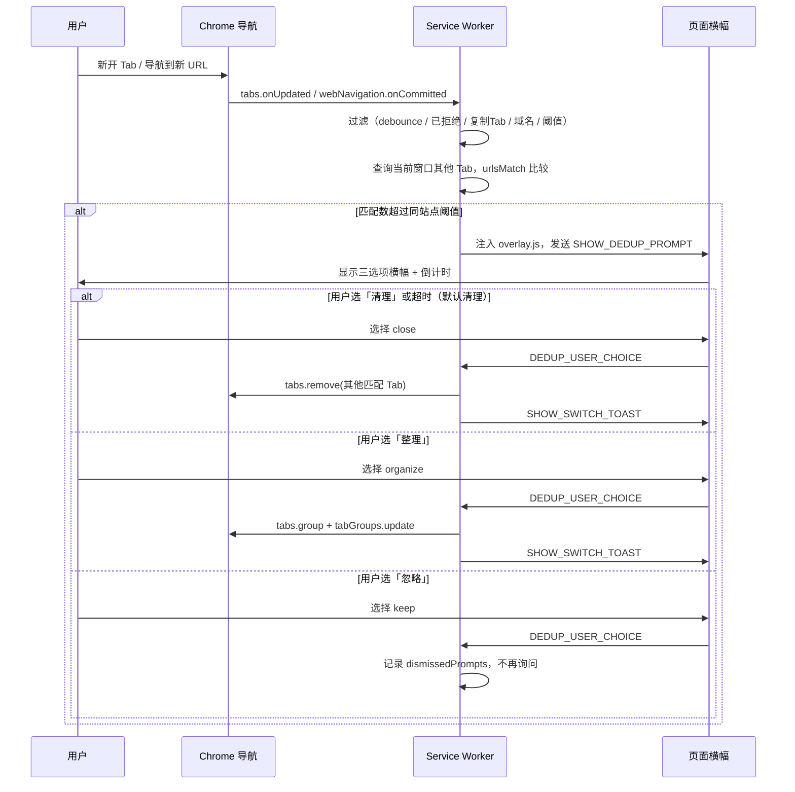

# Tab Dedup — Chrome 重复 Tab 管理

Chrome 扩展（Manifest V3），用于在**当前窗口**内检测重复的 Tab。当你新开或导航到一个页面，且窗口内已有其他 Tab 与之匹配时，会在当前 Tab 弹出半透明浮动卡片，提供**清理、整理到分组、忽略**三选项；默认超时后自动执行清理。

---

## 功能概览

| 能力 | 说明 |
|------|------|
| 窗口内查重 | 仅在当前 Chrome 窗口内查找匹配 Tab，跨窗口不受影响 |
| 可配置匹配规则 | 支持按域名、完整 URL、忽略 hash、忽略 query+hash 四种模式 |
| 域名过滤 | 白名单 / 黑名单，限制哪些域名参与检测 |
| 自动分组域名 | 指定域名超过阈值时静默归入 Tab 分组，不参与去重提示与批量去重 |
| 交互式确认 | 页面浮动卡片提供「清理 / 整理 / 忽略」三选项，可手动选择或键盘快捷键；位置与大小可配置 |
| 自动执行 | 可配置超时（默认 5 秒）及超时默认操作（清理 / 整理 / 无操作） |
| Tab 分组整理 | 将同域名或同匹配键的 Tab 归入 Chrome Tab 分组，分组标题为域名；已在分组内的 Tab 不再参与查重；整理成功后 Toast 提供约 8 秒「取消」按钮可重新展开 |
| 快捷设置弹窗 | 单击扩展图标，快速调整常用选项；顶部提供一键取消分组 / 去重 / 分组 |
| 双击扫描重复 Tab | 双击扩展图标，扫描当前窗口全部重复 Tab 并提供三选项 |
| 复制 Tab 排除 | 可配置：浏览器「复制标签页」打开的 Tab 不参与查重 |
| 同站点阈值 | 同站点 Tab 数量未超过设定值时不提醒 |
| 按域名自定义阈值 | 可为指定域名单独设置提醒阈值，覆盖全局同站点阈值 |
| 空 Tab 查重 | 可选：多个新标签页 / about:blank 也参与查重 |
| 降级通知 | 无法向页面注入 UI 时，回退为系统通知 |
| 操作反馈 | 清理或整理成功后显示短暂 Toast 提示；整理成功 Toast 含限时「取消」按钮可撤销分组 |

---

## 安装（开发者模式）

1. 打开 Chrome，访问 `chrome://extensions/`
2. 开启右上角「开发者模式」
3. 点击「加载已解压的扩展程序」
4. 选择本项目根目录

---

## 用户使用指南

### 典型场景

1. 窗口内已有 Tab A 打开 `https://example.com/page-a`
2. 新开 Tab B 并访问 `https://example.com/page-b`（同域名，默认匹配规则下视为重复）
3. Tab B 出现半透明浮动卡片（默认右上角）：「检测到 N 个相同域名的 Tab」
4. **清理**：点击「清理」或等待倒计时结束（默认）→ Tab A 被关闭，Tab B 保留，并显示「已关闭 N 个同域名 Tab」
5. **整理**：点击「整理」→ Tab A 与 Tab B 归入同一 Tab 分组（标题为域名），Tab 均保留；成功 Toast 约 8 秒内可点「取消」重新展开
6. **忽略**：点击「忽略」或按 `N` / `3` → 所有 Tab 均保留；同一 Tab 在同一 URL（按当前匹配规则归一化后）下不会再次弹出提示

### 不会触发的情况

- **同 Tab 内跳转**：在已有 Tab 的地址栏直接修改 URL，不会产生「其他 Tab」，因此不触发
- **跨窗口**：其他窗口中的同域名 Tab 不会被检测或关闭
- **非 HTTP(S) 页面**：`chrome://`、`about:`、`file://` 等内部页面不参与
- **已在 Tab 分组中**：当前 Tab 或窗口内其他匹配 Tab 若已在 Chrome Tab 分组内，不参与查重（整理到分组后不再重复提醒）
- **固定/置顶 Tab**：`tab.pinned` 为 true 的 Tab 不参与查重、关闭、整理与自动分组
- **用户已忽略**：在当前 Tab 上对同一匹配键（归一化 URL）点击「忽略」后，该 Tab 不再重复询问
- **域名被过滤**：当前域名不在白名单内，或在黑名单内（见下方配置说明）
- **自动分组域名**：名单内域名超过同站点阈值时自动归入 Tab 分组，不弹出查重提示（见下方配置说明）
- **复制的 Tab**（默认开启排除）：通过浏览器「复制标签页」打开的 Tab 不触发查重；新 Tab 手动输入网址仍会正常查重
- **未达同站点阈值**：例如阈值为 3 时，窗口内同站点 Tab 总数 ≤ 3 不提醒，第 4 个才弹出提示

### 打开设置

- **单击**扩展图标 → 快捷设置弹窗（顶部一键操作 + 常用选项）
- **双击**扩展图标 → 扫描当前窗口重复 Tab，提供清理 / 整理 / 忽略三选项
- 右键扩展图标 →「选项」→ 完整设置页
- 或在 `chrome://extensions/` 中找到本扩展 →「详细信息」→「扩展程序选项」

### 快捷一键操作

单击扩展图标打开快捷设置弹窗，顶部三个按钮**直接执行**，无需确认卡片：

| 按钮 | 行为 | 无操作时 |
|------|------|----------|
| **一键取消分组** | 当前窗口内所有已分组的 Tab 全部 `ungroup` | Toast「当前窗口没有已分组的 Tab」 |
| **一键去重** | 扫描重复 Tab 并关闭（等同双击扫描后选「清理」） | Toast「未发现重复 Tab」 |
| **一键分组** | 扫描重复 Tab 并整理到分组（等同双击扫描后选「整理」） | Toast「未发现重复 Tab」 |

规则与双击批量扫描一致：不受全局「同站点阈值」限制，但**已配置 per-domain 阈值的域名**在批量扫描中也会按该阈值过滤；空 Tab 始终参与；已在分组内或固定/置顶的 Tab 不参与去重/分组扫描。一键分组成功后 Toast 约 8 秒内可点「取消」撤销。若当前 Tab 已有浮动卡片待处理，按钮会提示「当前 Tab 正在处理中」。

快捷设置弹窗（单击扩展图标）还可调整：超时时间、空 Tab 查重、同站点阈值。其余选项在完整设置页。

### 配置项

#### 重复 Tab 提示

| 选项 | 默认值 | 说明 |
|------|--------|------|
| 超时后自动执行 | 开启 | 关闭后需手动选择操作 |
| 超时时间 | 5 秒 | 范围 1–30 秒，倒计时显示在超时默认操作对应按钮上 |
| 超时默认操作 | 清理 | 可选清理 / 整理 / 无操作；设为「无操作」时不启动倒计时 |
| 提示位置 | 右上角 | 可选左上 / 右上 / 顶部居中 / 左下 / 右下 / 中央 |
| 提示大小 | 小 | 可选小 / 中 / 大；卡片半透明，不阻挡页面其余区域点击 |
| 空 Tab 查重 | 关闭 | 开启后，新标签页 / about:blank 也会参与查重 |
| 复制的 Tab 不参与查重 | 是 | 开启后，复制标签页打开的 Tab 不触发查重，也不会被当作重复目标关闭 |
| 同站点 Tab 提醒阈值 | 1 | 范围 1–20；例如设为 3 表示 3 个以内不提醒，第 4 个才提醒 |
| 按域名自定义提醒阈值 | 空 | 每行 `域名或URL,阈值`，覆盖上方全局阈值；例如 `https://alidocs.dingtalk.com/,3` 表示该域名 3 个以内不提醒，第 4 个才提醒 |

### 双击扫描重复 Tab

在当前窗口内按当前匹配规则（域名 / 完整 URL 等）与域名过滤设置分组查重，不受**全局**「同站点阈值」限制（用户主动触发）；**已配置 per-domain 阈值的域名**在批量扫描中也会按该阈值过滤（未配置的域名仍为 2 个 Tab 即视为重复）。**空 Tab（新标签页 / about:blank 等）始终参与批量扫描**，无需开启「空 Tab 查重」；批量关闭时也不受「复制 Tab 排除」影响。若存在重复：

1. 在当前 Tab 弹出浮动卡片（或降级为系统通知）：「检测到 N 个重复 Tab（M 组）」
2. **清理**：每组保留 1 个 Tab（优先当前 Tab），关闭其余重复 Tab
3. **整理**：每个重复组各建一个 Tab 分组，标题为域名（空 Tab 组标题为「空 Tab」）
4. **忽略**：不做任何操作

若无重复 Tab，在当前页面显示「未发现重复 Tab」Toast（约 2 秒）。

**注意**：系统通知降级时仅提供「超时默认操作」与「忽略」两个按钮，完整三选项仅在页面浮动卡片中可用。

#### URL 匹配规则

| 模式 | 行为 | 示例 |
|------|------|------|
| **仅比较域名**（默认） | 同一 hostname 即视为重复；IP 与 `localhost` 按 host（含端口）区分 | `/login` 与 `/dashboard` 匹配；`192.168.1.1:8080` 与 `:9090` 不匹配 |
| **完整 URL 一致** | 协议、域名、路径、query、hash 全部相同 | 仅完全相同 URL 匹配 |
| **忽略 hash** | 去掉 `#` 后比较 | `#section-a` 与 `#section-b` 匹配 |
| **忽略 query 和 hash** | 仅比较协议 + 域名 + 路径 | `?id=1` 与 `?id=2` 匹配 |

路径末尾的 `/` 会在比较前统一去除（`/path` 与 `/path/` 视为相同）。

#### 域名过滤

- **白名单**：填写后，**仅**对白名单中的域名生效；留空表示不启用白名单
- **黑名单**：填写后，**排除**黑名单中的域名，不参与查重；留空表示不排除任何域名
- **自动分组域名**：填写后，名单内域名超过同站点阈值时**自动归入 Tab 分组**（静默，不弹出提示）；新 Tab 会并入同窗口内已有的同域名分组；**不参与**双击扫描、一键去重/分组
- 白名单与黑名单同时填写时，**同时生效**：必须在白名单内且不在黑名单内，才检测或自动分组
- 黑名单优先：域名同时在黑名单与自动分组名单中时，完全跳过（不查重也不自动分组）
- 支持子域名匹配：`github.com` 也会匹配 `docs.github.com`
- 输入格式：裸域名（`github.com`）或完整 URL（`https://github.com/repo`）均可；路径、query、hash、端口会在解析时自动剥离为 hostname
- 每行一个域名或 URL，也支持逗号分隔

---

## 架构与实现逻辑

### 整体架构

```
┌─────────────────────────────────────────────────────────────┐
│                     Service Worker                          │
│  (src/background/service-worker.js)                         │
│                                                             │
│  监听导航 → 查重 → 复制Tab过滤 → 域名过滤 → 自动分组 / 提示 / 清理 / 整理   │
└──────┬───────────────────────┬──────────────────┬───────────┘
       │ chrome.scripting       │ chrome.notifications│ messages
       ▼                        ▼ (降级)              ▼
┌──────────────────┐   ┌─────────────────┐   ┌──────────────────┐
│ overlay (注入)    │   │ 系统通知         │   │ tab-origin.js    │
│ 横幅 / Toast     │   │ (无法注入时)     │   │ (manifest 注册)   │
└──────────────────┘   └─────────────────┘   │ sessionStorage   │
                                              │ TAB_ORIGIN_CHECK │
                                              └──────────────────┘

┌──────────────────────────┐   ┌──────────────────────────┐
│  Popup（快捷设置）         │   │  Options Page（完整设置）  │
│  popup.html / popup.js   │   │  options.html / options.js│
│  storage + QUICK_ACTION  │   │  chrome.storage.sync      │
└──────────────────────────┘   └──────────────────────────┘
```

扩展采用 **Manifest V3** 架构：后台逻辑运行在 Service Worker 中；`tab-origin.js` 在 `document_start` 自动注入以识别复制 Tab；浮动卡片与 Toast 通过 `chrome.scripting` 按需注入；设置持久化在 `chrome.storage.sync`。

### 触发流程



### 导航监听

Service Worker 监听以下事件以覆盖不同类型的页面跳转：

1. **`chrome.tabs.onUpdated`**：`status === 'complete'` 时触发查重；`changeInfo.url` 变化时清除该 Tab 的提示状态
2. **`chrome.webNavigation.onCompleted`**：主框架（`frameId === 0`）加载完成时触发查重
3. **`chrome.webNavigation.onCommitted`**：主框架提交时清除提示状态（避免 SPA 路由切换残留旧横幅）
4. **`chrome.tabs.onCreated`**：辅助识别复制 Tab（无 `openerTabId` 且左侧 Tab URL 相同）

查重入口仅处理可检测 URL：`http(s)://`，或在开启空 Tab 查重时的 `chrome://newtab/`、`about:blank` 等。

### 查重核心逻辑

`handleDuplicateNavigation(tabId, tab, url)` 是查重入口，按以下顺序执行：

1. **并发保护**：若该 Tab 正在处理关闭（`processingTabs`）或已有活跃提示（`activePrompts`），跳过
2. **防抖**：同一 `tabId + url` 在 800ms 内不重复检测（`recentChecks`）
3. **读取设置**：从 `chrome.storage.sync` 加载并 merge 默认值
4. **拒绝记忆**：若用户此前在该 Tab 上对当前归一化 URL 点了「忽略」（`dismissedPrompts`），跳过
5. **复制 Tab 排除**：若开启 `excludeDuplicatedTabs`，等待 `tab-origin.js` 上报或相邻 Tab 探测完成；已标记为复制的 Tab 跳过
6. **Tab 分组与固定 Tab 排除**：当前 Tab 已在 Chrome Tab 分组内或为固定/置顶 Tab 则跳过；匹配候选中分组内或固定 Tab 亦排除
7. **域名过滤**：非空 Tab 时调用 `shouldSkipByDomain()` 检查白名单 / 黑名单
8. **自动分组域名**：若 `shouldAutoGroupByDomain()` 命中，调用 `handleAutoGroupNavigation()` 静默归入 Tab 分组后返回，不弹出查重提示
9. **窗口内匹配**：`chrome.tabs.query({ windowId })` 获取当前窗口所有 Tab，排除自身、分组内 Tab、固定 Tab 与复制 Tab 后，用 `urlsMatchForDedup()` 逐一比较
10. **同站点阈值**：`getSameSiteTabLimitForHostname()` 查找 per-domain 配置（`domainTabLimits`），未命中则用全局 `sameSiteTabLimit`；`matches.length + 1 > limit` 时才继续（默认阈值为 1，即有一个重复即提醒）
11. **展示提示**：调用 `showClosePrompt()`

### URL 匹配（`src/utils/url-matcher.js`）

`normalizeUrl(url, mode)` 将 URL 归一化为可比较的键：

| mode | 归一化结果 |
|------|-----------|
| `domainOnly` | hostname；IP 与 `localhost` 为 host（含端口） |
| `strict` | 完整 href（去除末尾 `/`） |
| `ignoreHash` | 去掉 hash 后的 href |
| `ignoreQueryHash` | 去掉 search 和 hash 后的 href |

`urlsMatch(urlA, urlB, mode)` 比较两个 URL 归一化后是否相等。

`isEmptyTabUrl(url)` 判断新标签页 / about:blank 等空 Tab URL；开启空 Tab 查重时，两个空 Tab 视为匹配。

### 复制 Tab 识别（`src/content/tab-origin.js`）

`manifest.json` 在 `document_start` 注册 `tab-origin.js`，在所有 http(s) 页面自动运行：

1. 每个 Tab 在 `sessionStorage` 写入 `__tab_dedup_origin_tab_id__`（首次为当前 tabId）
2. 页面加载时发送 `TAB_ORIGIN_CHECK`，Service Worker 对比 storedTabId 与当前 tabId
3. 结合**左侧相邻 Tab**、**strict URL 相同**、**无 openerTabId** 判定是否为浏览器「复制标签页」
4. 扩展安装/更新时，Service Worker 对已有 Tab 补写 sessionStorage

### 域名过滤（`src/utils/domain-list.js`）

`parseDomainList(text)` 将用户输入（裸域名或完整 http/https URL）规范化为 hostname 列表：支持逗号/换行分隔；无协议时补 `https://` 后用 URL API 提取 hostname；路径、query、hash、端口自动剥离；无法解析时走正则兜底。

`parseDomainTabLimits(text)` 按行解析 `域名或URL,阈值` 配置（逗号仅作 domain 与 limit 分隔，不用 `parseDomainList` 的分割规则）；`getSameSiteTabLimitForHostname()` / `getBulkScanTabLimitForHostname()` 按 hostname 查找 per-domain 阈值（最长 hostname 优先），导航/自动分组 fallback 全局阈值，批量扫描 fallback 1。

`shouldSkipByDomain(hostname, whitelist, blacklist)`：

- 白名单非空且域名不在白名单内 → **跳过**
- 黑名单非空且域名在黑名单内 → **跳过**
- 两者均为空 → 检测所有 http/https 域名
- 两者均非空 → 须同时满足「在白名单内」且「不在黑名单内」

域名匹配支持精确匹配和子域名后缀匹配（`host.endsWith('.' + entry)`）。

`shouldAutoGroupByDomain(hostname, autoGroupDomains)`：名单非空且域名匹配时返回 true，触发静默自动分组（`handleAutoGroupNavigation`）。自动分组时允许匹配已在分组内的 Tab，新 Tab 并入已有同域名分组；无已有分组时创建新分组。批量扫描通过 `shouldIncludeTabInBulkScan` 排除自动分组域名。

### 用户交互

#### 页面浮动卡片（`src/content/overlay.js`）

- 通过独立 host 元素 + `all: initial` 样式重置，减少对页面样式的干扰
- 接收 `SHOW_DEDUP_PROMPT` 消息，渲染半透明浮动卡片（默认右上角、小尺寸）
- 位置与大小可在设置页配置；host 层 `pointer-events: none`，仅卡片可交互
- **键盘快捷键**（仅页面卡片）：`1` / `C` → 清理；`2` / `G` → 整理；`3` / `N` / `Esc` → 忽略
- 倒计时结束后按「超时默认操作」自动发送对应 choice（默认 `close`）
- 用户选择通过 `DEDUP_USER_CHOICE` 消息回传 Service Worker
- 整理成功 Toast 可点「取消」，通过 `DEDUP_UNDO_ORGANIZE` 消息触发 `chrome.tabs.ungroup` 重新展开 Tab（约 8 秒有效）

**Popup 快捷操作**（`popup.js` → `QUICK_ACTION` 消息）：

- `ungroup-all`：当前窗口全部已分组 Tab 取消分组
- `dedup-close`：批量扫描并直接关闭重复 Tab
- `dedup-organize`：批量扫描并直接整理到分组
- 关闭完成后接收 `SHOW_SWITCH_TOAST` 显示操作反馈

#### 系统通知降级

当 `chrome.scripting.executeScript` 注入失败（如 Chrome 内部页、受限页面）时：

- 创建 `chrome.notifications` 通知，带「超时默认操作 / 忽略」两个按钮
- 同样支持超时自动执行（按 `autoActionOnTimeout` 配置）
- 点击通知本身视为执行超时默认操作
- **不支持完整三选项**（系统通知最多 2 按钮；整理需使用页面卡片）

### 状态管理

Service Worker 维护以下内存状态（Tab 关闭时自动清理）：

| 变量 | 用途 |
|------|------|
| `processingTabs` | 正在执行关闭操作的 Tab ID |
| `activePrompts` | 当前有活跃提示的 Tab 及其上下文 |
| `pendingNotifications` | 降级通知的待处理数据 |
| `pendingOrganizeUndo` | 整理成功后可撤销的 Tab ID 集合（约 8 秒有效） |
| `recentChecks` | 防抖时间戳 |
| `dismissedPrompts` | 用户拒绝后不再提示的 Tab + URL 键 |
| `duplicatedTabIds` | 被识别为「复制标签页」的 Tab ID |
| `originCheckCompleted` | 已完成来源检测的 Tab ID（含复制 Tab 判定结果） |

### 设置与迁移

- 默认设置定义在 `src/utils/defaults.js`
- 首次安装时写入 `chrome.storage.sync`
- 从旧版本升级时，若 `matchMode` 为 `ignoreHash` 或未设置，自动迁移为 `domainOnly`
- 兼容旧字段名 `askAutoSwitchEnabled` / `askAutoSwitchSeconds`

---

## 目录结构

```
chrome-tab-dedup/
├── manifest.json                 # 扩展清单（MV3）
├── icons/                        # 扩展图标（SVG 源 + 16/48/128 PNG；双 Tab 线条轮廓）
├── src/
│   ├── background/
│   │   └── service-worker.js     # 后台：导航监听、查重、关闭、消息路由
│   ├── content/
│   │   ├── tab-origin.js         # 自动注入：复制 Tab 识别（sessionStorage）
│   │   ├── overlay.js            # 按需注入：浮动卡片、Toast、键盘快捷键
│   │   └── overlay.css           # 注入样式
│   ├── popup/
│   │   ├── popup.html            # 快捷设置弹窗（一键操作 + 常用选项）
│   │   ├── popup.js
│   │   └── popup.css
│   ├── options/
│   │   ├── options.html          # 设置页
│   │   ├── options.js            # 设置读写
│   │   └── options.css           # 设置页样式
│   └── utils/
│       ├── defaults.js           # 默认配置与 merge 逻辑
│       ├── url-matcher.js        # URL 归一化与匹配（扩展环境）
│       ├── url-matcher.node.js   # 同上（Node 测试用）
│       ├── domain-list.js        # 域名白/黑名单解析与匹配
│       └── domain-list.node.js   # 同上（Node 测试用）
├── docs/
│   └── PROJECT-MAINTENANCE.md    # 维护者文档与变更记录
└── tests/
    ├── url-matcher.test.js       # URL 匹配单元测试
    └── domain-list.test.js       # 域名列表单元测试
```

### 权限说明

| 权限 | 用途 |
|------|------|
| `tabs` | 查询、关闭、分组 Tab |
| `tabGroups` | 更新 Tab 分组标题与属性 |
| `storage` | 持久化用户设置 |
| `scripting` | 向页面注入横幅和 Toast |
| `notifications` | 注入失败时的系统通知降级 |
| `webNavigation` | 捕获 SPA 导航 |
| `<all_urls>` | 在所有 http/https 页面上运行 |

`manifest.json` 还通过 `content_scripts` 在 http(s) 页面 `document_start` 自动注入 `tab-origin.js`（复制 Tab 识别）。

---

## 开发与测试

### 运行单元测试

```bash
node tests/url-matcher.test.js
node tests/domain-list.test.js
```

### 手动测试清单

1. Tab A 打开 `https://example.com/page-a`，新开 Tab B 访问 `https://example.com/page-b` → B 出现浮动卡片，5s 后 A 自动关闭（默认清理）
2. 同上场景，点击「忽略」或按 `N` / `3` → A、B 均保留，B 不再重复提示
3. 同上场景，点击「整理」→ A、B 归入同一 Tab 分组，标题为 `example.com`；Toast 点「取消」→ Tab 重新展开
4. 窗口内有 A、C 两个同域名 Tab，新开 B → 选清理后 A 和 C 均被关闭，仅 B 保留
5. 在 Tab A 地址栏直接跳转到 `/page-b`（同 Tab）→ 不触发任何提示
6. 白名单加入 `example.com` 后，仅对该域名生效；其他域名不触发
7. 黑名单加入 `example.com` 后，该域名不触发；其他域名正常查重
8. 在另一个窗口打开相同 URL，当前窗口新开同域名 Tab → 不应拦截
9. 切换匹配模式为「完整 URL 一致」，仅完全相同 URL 才触发
10. 中键 / Ctrl+点击链接打开新 Tab → 正常触发检测
11. 复制 Tab A（右键「复制标签页」）→ 复制的 Tab 不触发查重；新 Tab 手动输入同域名 URL 仍触发
12. 同站点阈值设为 3 → 第 1–3 个同站点 Tab 不提醒，第 4 个才出现提示
13. 设置页调整提示位置与大小 → 重新触发查重，卡片出现在对应位置与尺寸
14. 开启空 Tab 查重 → 多个新标签页之间触发提醒
15. 窗口内打开多个同域名 Tab → 双击扩展图标 → 出现三选项提示；选整理后同域名 Tab 归入分组
16. 窗口内无重复 Tab → 双击扩展图标 → 显示「未发现重复 Tab」Toast
17. 设置超时默认操作为「整理」→ 倒计时显示在「整理」按钮上，超时后自动分组
18. 同域名 Tab 整理到分组后，再新开同域名 Tab → 若已有 Tab 均在分组内则不触发；仅未分组的同域名 Tab 仍参与查重
19. 整理成功 Toast 约 8 秒内点「取消」→ Tab 从分组移出并重新展开；取消后同域名 Tab 可再次触发查重
20. 单击扩展图标 →「一键去重」→ 重复 Tab 直接关闭，无确认卡片
21. 单击扩展图标 →「一键分组」→ 重复 Tab 直接归入分组
22. 窗口内有已分组 Tab →「一键取消分组」→ 全部展开；无分组时 Toast 提示
23. 自动分组域名加入 `github.com` → 第 2 个同域名 Tab 静默归入分组，无浮动卡片；第 3 个 Tab 自动并入已有分组
24. 自动分组域名内的 Tab → 双击扫描 / 一键去重 / 一键分组均不包含该域名 Tab
25. 按域名自定义阈值加入 `alidocs.dingtalk.com,3` → 该域名第 1–3 个 Tab 不提醒，第 4 个才出现提示；其他域名仍用全局阈值
26. 同上配置 → 窗口内仅 3 个该域名 Tab 时双击扫描 →「未发现重复 Tab」；第 4 个 Tab 后双击扫描才出现提示
27. 固定同域名 Tab 与普通 Tab 并存 → 固定 Tab 不计入重复数、不触发提示；批量去重不关闭固定 Tab
28. 当前 Tab 为固定/置顶 → 导航到同域名页面不触发查重

### 调试建议

- Service Worker 日志：扩展管理页 → 「Service Worker」→ 检查
- Content Script 日志：目标页面 DevTools Console（需过滤 `[Tab Dedup]`）
- 设置变更：修改后立即生效，无需重启扩展

---

## 版本

当前版本：**1.2.0**（见 `manifest.json`）

维护者文档与变更记录见 [docs/PROJECT-MAINTENANCE.md](docs/PROJECT-MAINTENANCE.md)。
